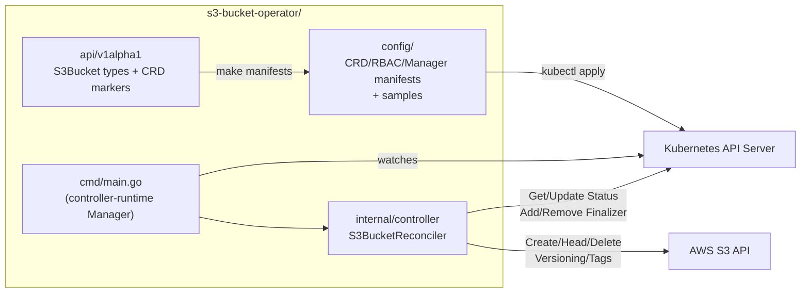
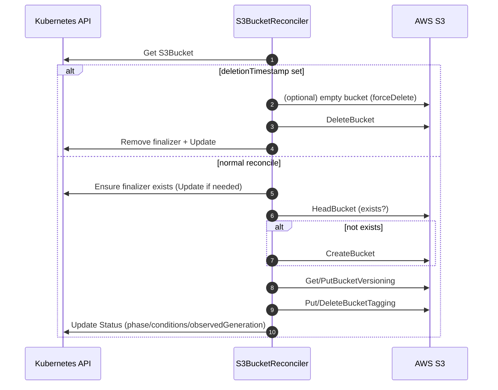

# s3-bucket-operator

Kubernetes controller (Kubebuilder + Go) that manages **AWS S3 buckets** via a CustomResourceDefinition:

- **`apiVersion`**: `aws.techfueled.dev/v1alpha1`
- **`kind`**: `S3Bucket`

## High-level controller flow

- **Bootstrap**: `kubebuilder init` + `kubebuilder create api`
- **Define API**: Spec (desired) + Status (observed) in `api/v1alpha1/`
- **Generate**: `make generate` + `make manifests`
- **Reconcile**: fetch → decide → act → update status (idempotent control loop)
- **Run**: `make install` + `make run` (local) or `make deploy` (in-cluster)

## API shape

The `S3Bucket` spec currently supports:

- `spec.bucketName` (required)
- `spec.region` (required)
- `spec.versioning` (optional)
- `spec.tags` (optional)
- `spec.forceDelete` (optional; empties bucket before delete)

Samples live in `config/samples/`.

## Concepts

If you’re new to operators/Kubebuilder terms, see `docs/concepts.md`.

## Architecture

### Runtime and ownership view



### Reconcile loop sequence



## Authentication on EKS (recommended)

This controller uses the AWS SDK credential chain (no static keys). On EKS, use
**EKS Pod Identity** (recommended) to provide credentials to the controller Pod
via an association to its ServiceAccount.

> [!NOTE]
> No code changes are required for Pod Identity. The AWS SDK automatically picks up credentials when running in-cluster.

## Why finalizers matter

S3 buckets are **external state**. This controller adds a finalizer so that
deleting the `S3Bucket` CR can first delete (or attempt to delete) the real S3
bucket, and only then allow Kubernetes to remove the CR.

> [!IMPORTANT]
> If `forceDelete` is false and the bucket is not empty, deletion can fail and
> the CR can remain in `Terminating` until the bucket is emptied or
> `forceDelete` is enabled.

## Install the CRD on a cluster

> [!IMPORTANT]
> Installing the CRD only enables the Kubernetes API type (`S3Bucket`). It does
> not run the controller. If you apply `S3Bucket` objects without a running
> controller, nothing will reconcile them.

### Prerequisites

- `kubectl` configured to point at your cluster
- `go` and `make` (for the `make install` workflow)

### Install

From the repo root:

```sh
make manifests
make install
```

### Verify the CRD is installed

```sh
kubectl get crd | grep -E '^s3buckets\\.aws\\.techfueled\\.dev'
kubectl api-resources | grep -i s3bucket
```

### Apply an example `S3Bucket`

```sh
kubectl apply -k config/samples/
kubectl get s3buckets
```

### Uninstall

```sh
make uninstall
```

## Local development

Generate CRDs/manifests after changing API markers:

```sh
make generate
make manifests
```

Run against your current kubeconfig context (out-of-cluster):

```sh
make install
make run
```

Apply the sample CR:

```sh
kubectl apply -k config/samples/
```

## Build & deploy

```sh
make docker-build docker-push IMG=<some-registry>/s3-bucket-operator:tag
make deploy IMG=<some-registry>/s3-bucket-operator:tag
```

## Tests

```sh
make test
```

## License

Apache 2.0 (see headers in source files).
